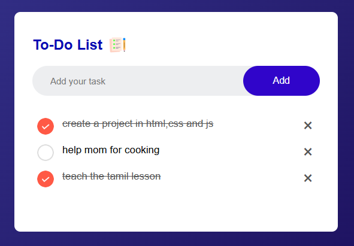
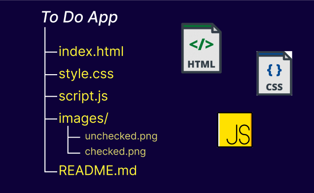

# To-Do List Application

### **A simple, elegant To-Do List web application that helps users manage their daily tasks effectively. Built with HTML, CSS, and JavaScript, it features task addition, deletion, and local storage support to persist tasks across browser sessions.**

---

## To-Do-App

## Features

1. Add Tasks: Quickly add tasks using the input box and "Add" button.
2. Mark as Complete: Click on a task to mark it as completed (adds a strikethrough).
3. Delete Tasks: Remove tasks using the delete button (×).
Persistent Storage: Tasks are saved to the browser's local storage, so they remain available even after refreshing or reopening the application.

## Technologies Used
1. HTML5: For the application's structure.
2. CSS3: For the styling and layout.
3. JavaScript: For functionality and interactivity.

## Usage

Open the app in a web browser.
Enter a task in the input field and click Add.
Click on a task to mark it as completed.
Click the delete button (×) to remove a task.

## License
This project is open-source and free to use under the MIT License